#### Captures d'écran SOAP UI

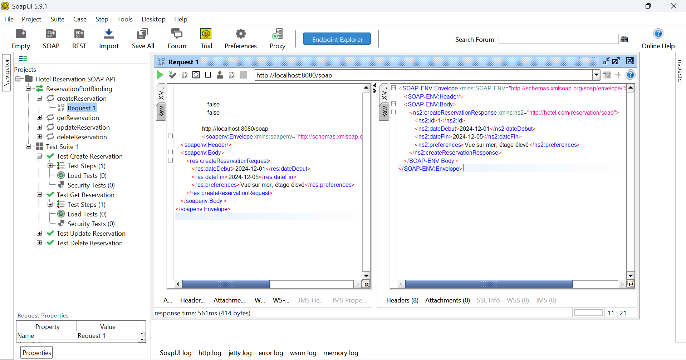

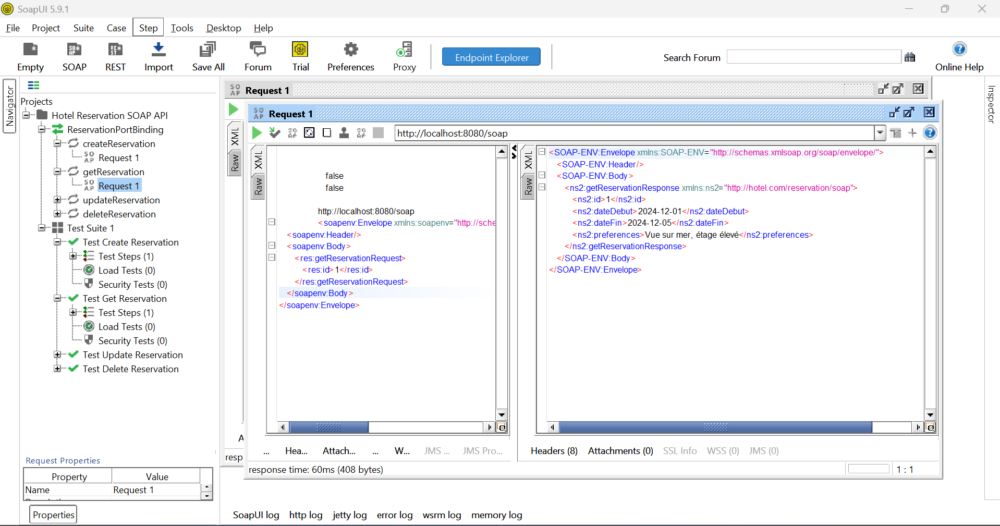

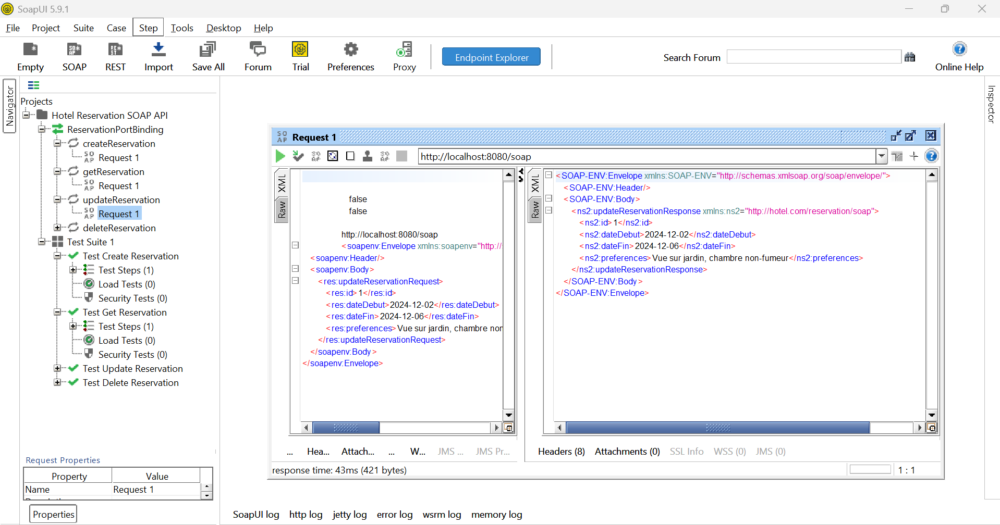

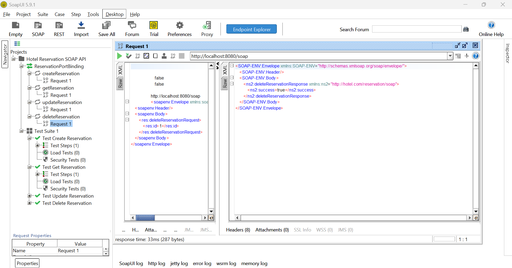


#### Captures d'écran GraphQL


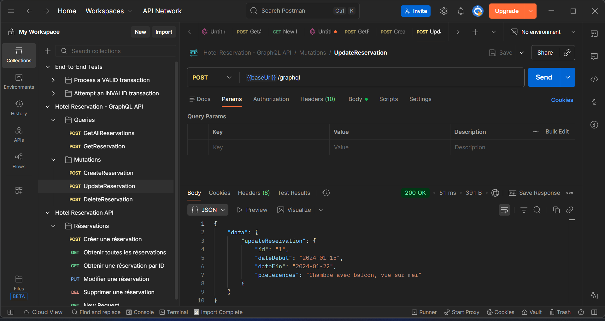

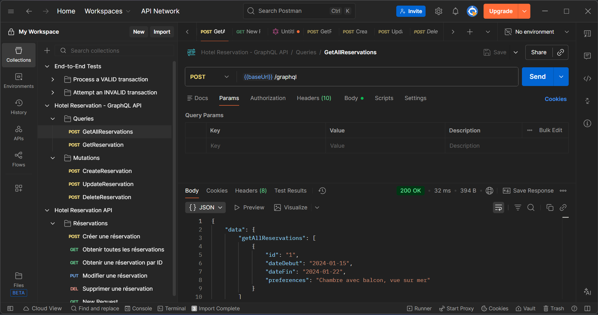

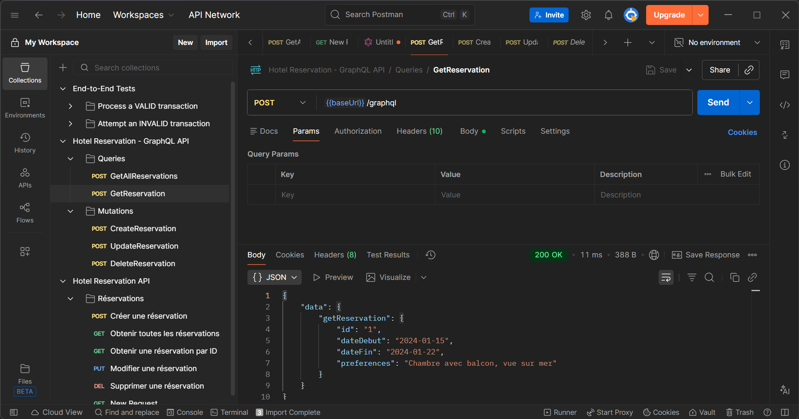


#### Captures d'écran gRPC (BloomRPC)

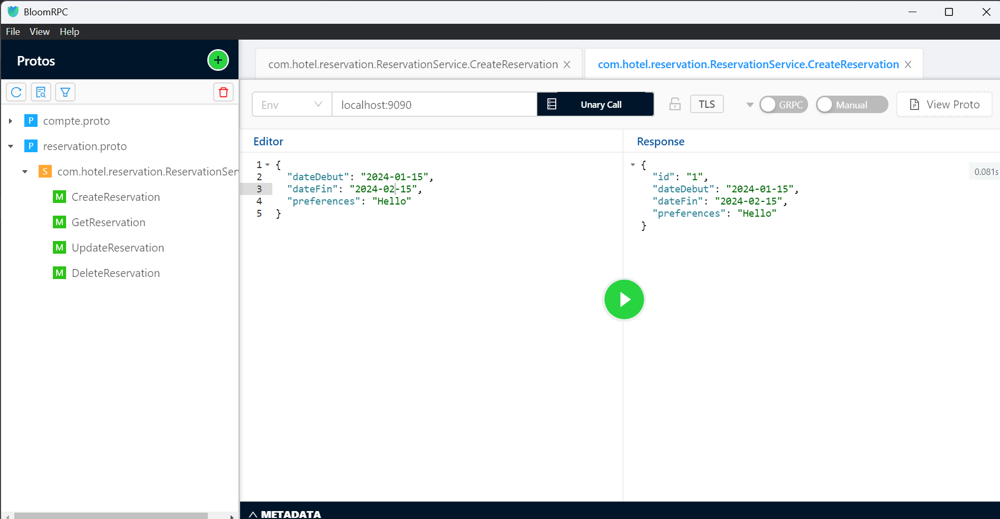

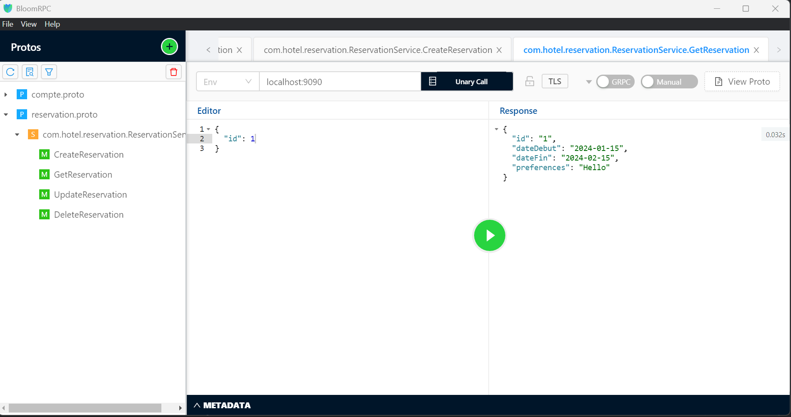

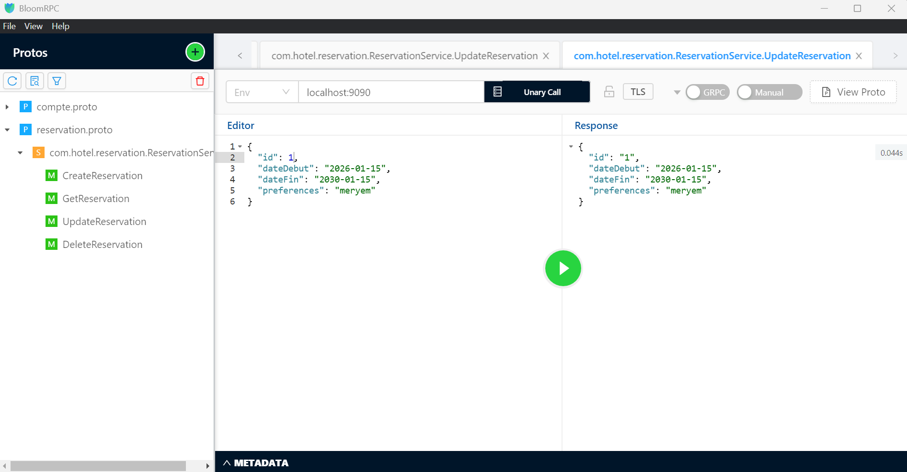

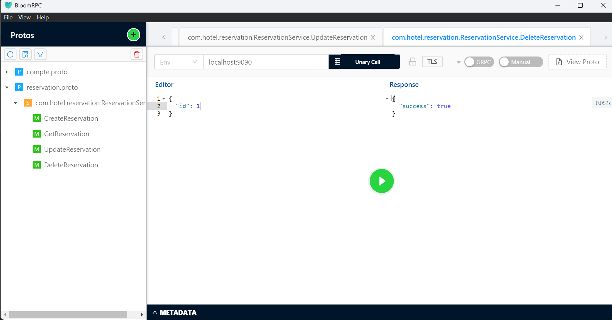


### Captures d'écran Postman

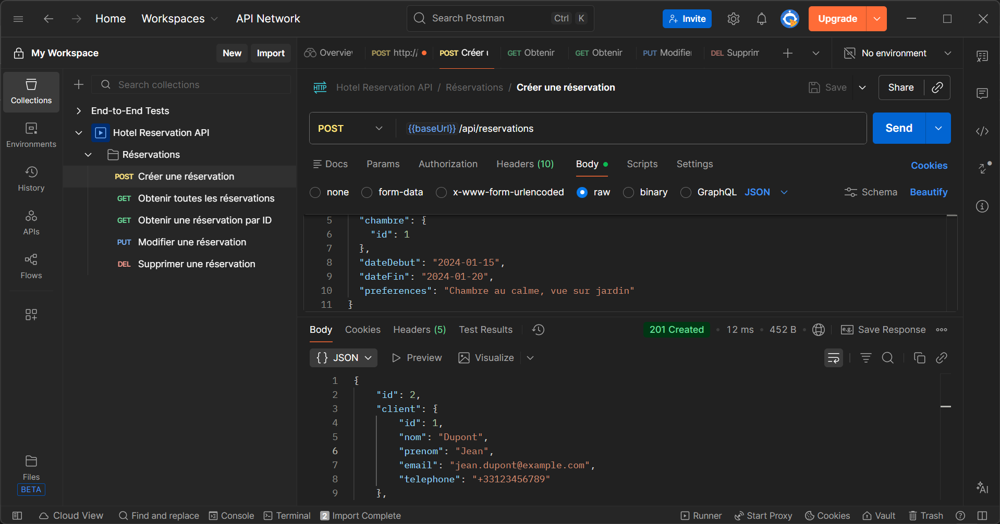

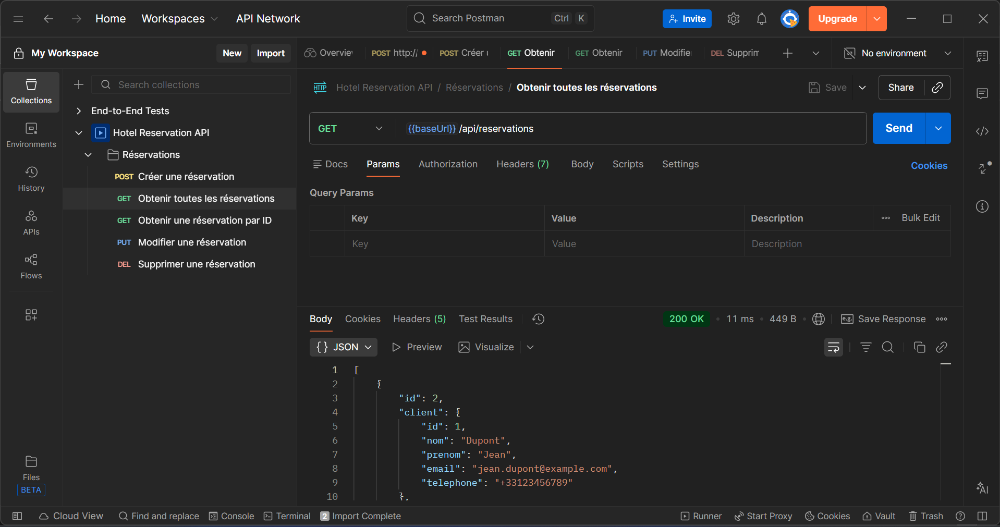

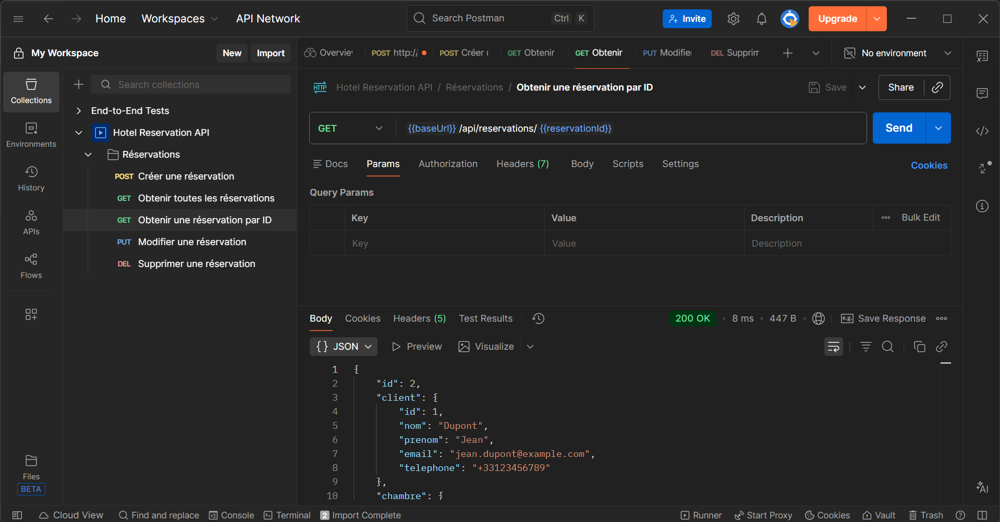

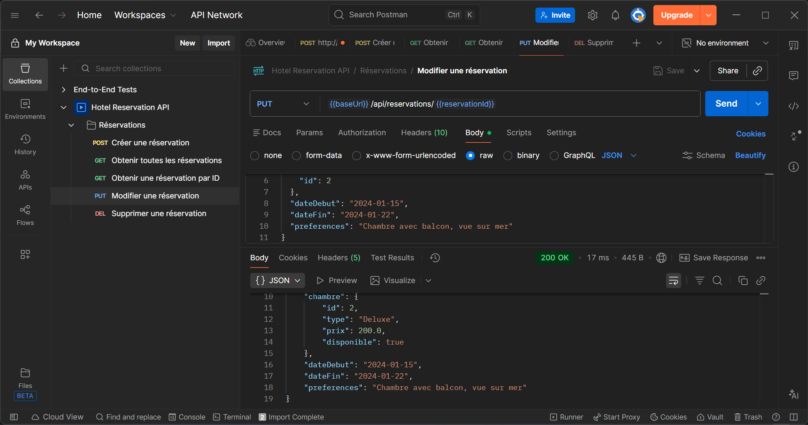

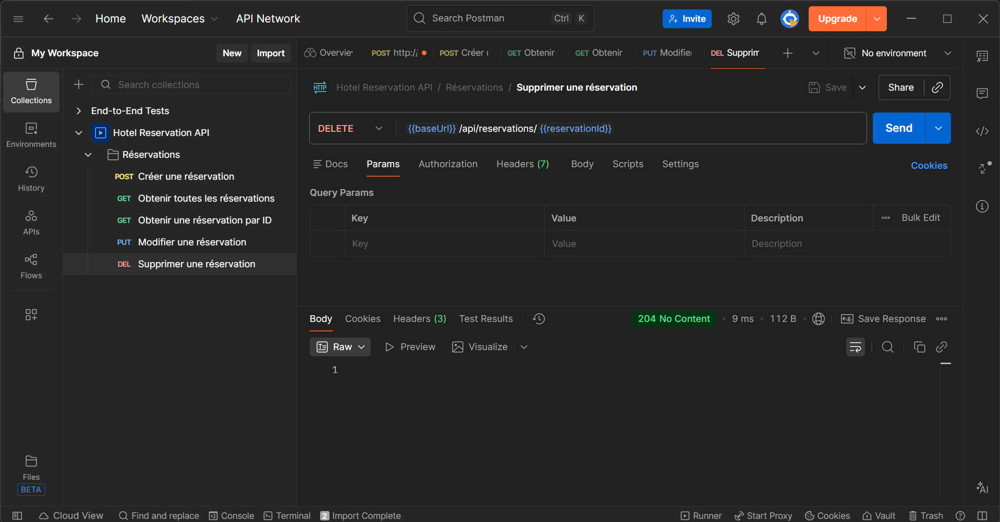


npm start
```

Le frontend sera accessible sur `http://localhost:3000`

